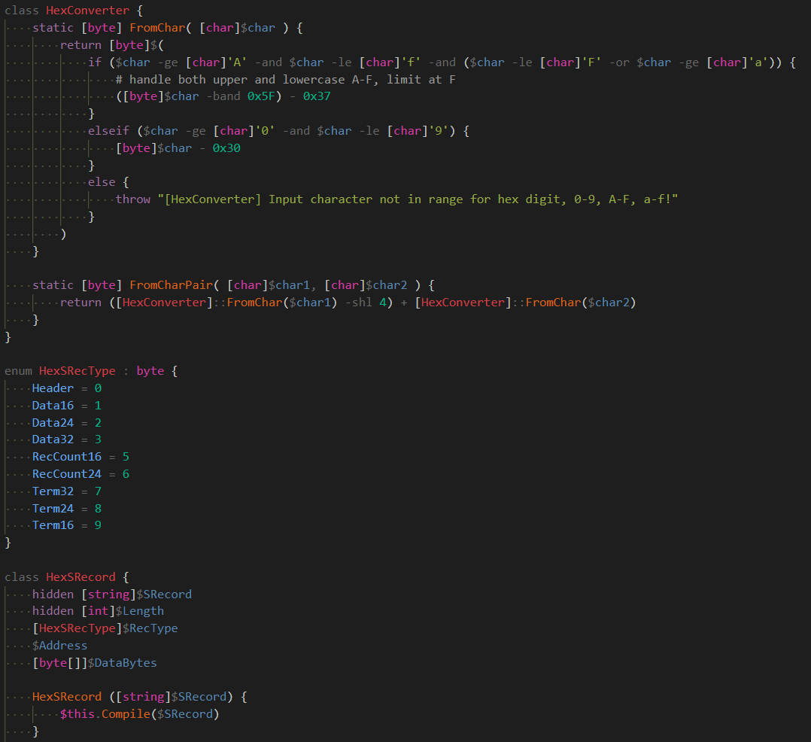
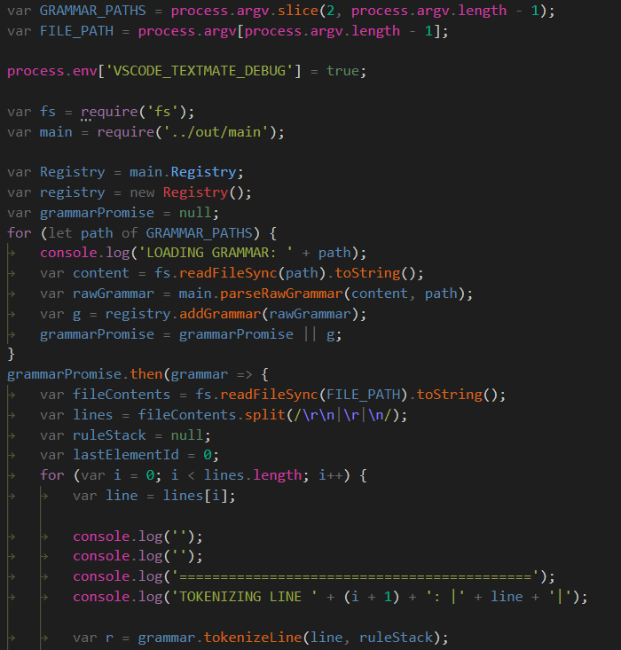
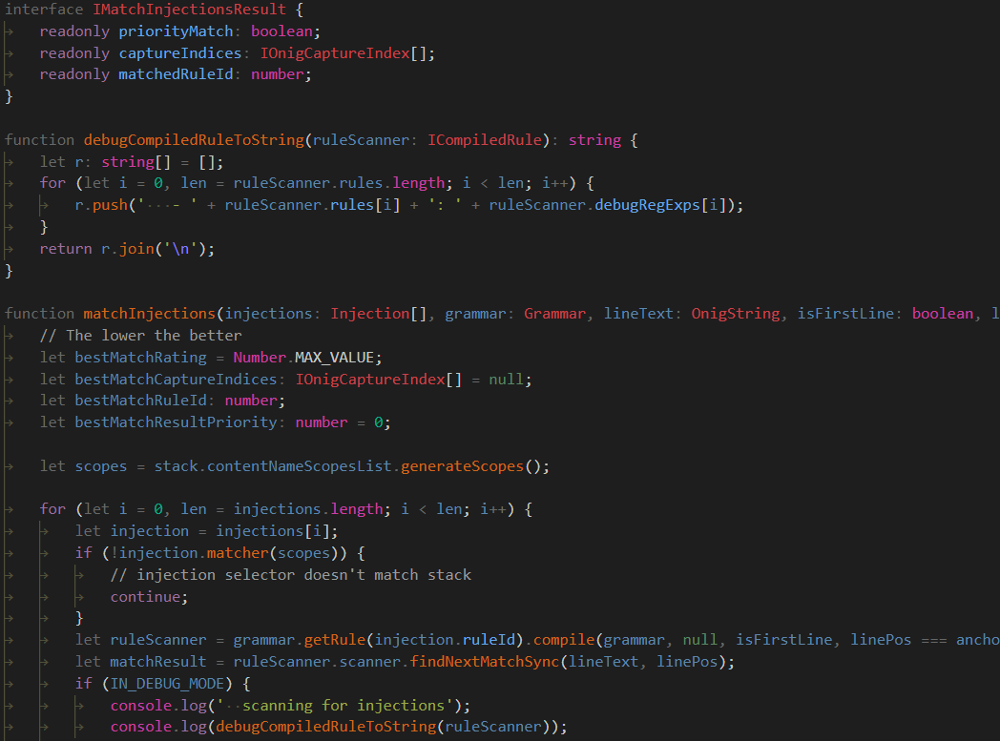
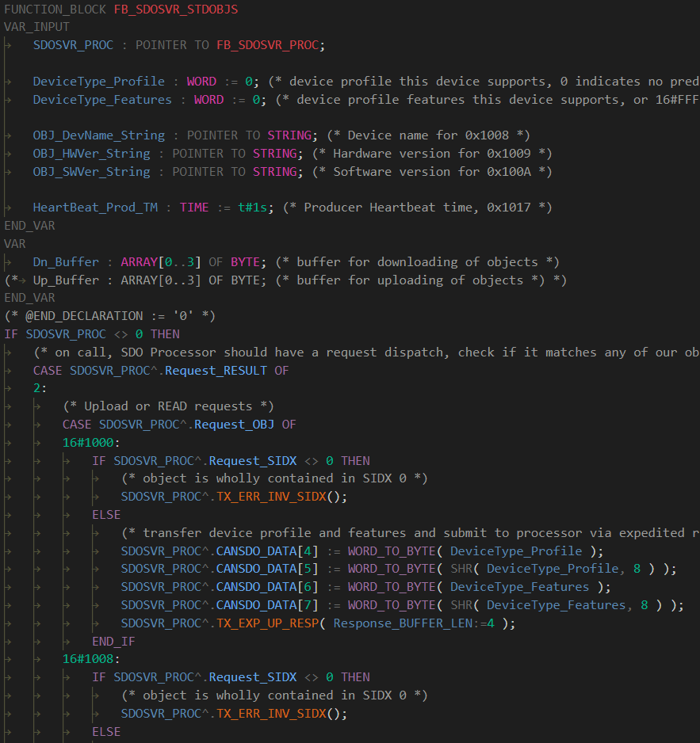

# A Monokai Less Dimmed Theme for Visual Studio Code

A less dimmed theme based on Monokai Dimmed, with an broadened palette specifically configured to unify JavaScript / TypeScript / C# / PowerShell / IEC 61131-3 Structured Text and others for a consistent editing experience when your projects involve multiple languages.

 - PowerShell

   

 - JavaScript

   

 - TypeScript

   

 - IEC 61131-3 Structured Text

   
